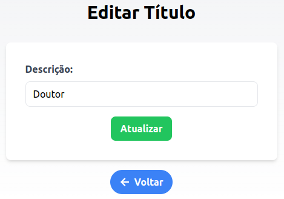

### Exercício Prático: Desenvolvimento de um CRUD para Gerenciamento de Títulos

#### Objetivo:
Desenvolver uma aplicação web utilizando **Next.js**, **TailwindCSS** e **TypeScript** para gerenciar uma tabela de títulos acadêmicos. O exercício consiste em criar um CRUD (Create, Read, Update, Delete) completo para a tabela de títulos, semelhante ao que foi apresentado nas imagens fornecidas.

#### Requisitos:
- **Framework**: Next.js
- **Estilização**: TailwindCSS
- **Linguagem**: TypeScript
- **Banco de Dados**: Você pode usar PostgreSQL ou outro banco de dados relacional de sua escolha.
- **API REST**: Desenvolver uma API para interagir com o banco de dados.

### Endpoints Necessários
1. **GET /titulo**: Retorna uma lista de todos os títulos cadastrados.
2. **GET /titulo/{id}**: Retorna os detalhes de um título específico.
3. **POST /titulo**: Adiciona um novo título ao banco de dados.
4. **PUT /titulo/{id}**: Atualiza as informações de um título específico.
5. **DELETE /titulo/{id}**: Remove um título do banco de dados.

**Nota**: É **recomendado** que cada aluno desenvolva sua própria API e endpoints, em vez de utilizar endpoints fornecidos pelo professor, para reforçar o aprendizado no desenvolvimento de backend.

### Questões Específicas

1. **Listagem de Títulos (Read)**:
   - **Questão**: Desenvolva a página inicial da aplicação onde uma lista de títulos cadastrados é exibida. Cada título deve apresentar as opções de edição e exclusão. Como você faria para garantir que, ao carregar a lista, uma mensagem de "Carregando..." seja exibida enquanto os dados são buscados na API?

2. **Adição de Novo Título (Create)**:
   - **Questão**: Crie uma página dedicada para a adição de novos títulos. Como você implementaria a funcionalidade para que, ao submeter o formulário, o novo título seja inserido no banco de dados e o usuário seja redirecionado de volta para a página de listagem?

3. **Edição de Título (Update)**:
   - **Questão**: Implemente a página de edição de títulos, onde o usuário pode atualizar a descrição de um título existente. Explique como você trataria a situação em que o usuário tenta salvar as alterações, mas a API retorna um erro. Como você apresentaria esse erro ao usuário?

4. **Exclusão de Título (Delete)**:
   - **Questão**: Implemente a funcionalidade de exclusão de títulos na listagem principal. Ao clicar no botão de exclusão, como você confirmaria a intenção do usuário de deletar um título antes de realmente realizar a operação na base de dados?

### Sugestões de Implementação

- **Estilização com TailwindCSS**: Utilize classes utilitárias do TailwindCSS para estilizar sua aplicação. Isso permitirá uma maior personalização e consistência visual, além de facilitar a manutenção do código.
  
- **TypeScript**: Tipifique as funções e componentes para garantir maior robustez no código. Utilize interfaces e tipos personalizados para descrever os dados que serão manipulados na aplicação.

### Imagens de Referência

**Tela de Listagem de Títulos**:

**Tela de Adição de Título**:

**Tela de Edição de Novo Título**:

### Entrega
O projeto não precisa ser entregue. Precisa ser desenvolvido pelo aluno. Nossas provas serão práticas... à semelhança deste exercício.

---

Esse exercício visa a aplicação prática de conceitos importantes de desenvolvimento web, como a criação de APIs RESTful, a construção de interfaces dinâmicas e responsivas, e o uso de TypeScript para aumentar a segurança e a previsibilidade do código. Boa trabalho!!!
